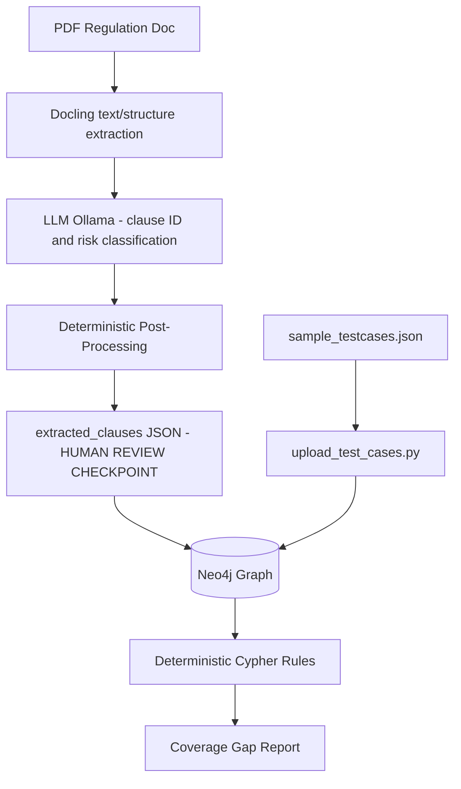
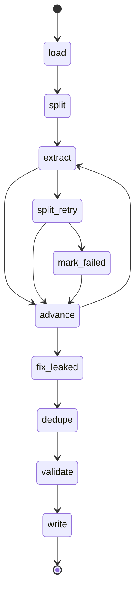

# Regulatory Test Intelligence

AI-assisted pipeline that reads banking regulatory compliance PDFs, extracts
clauses via LLM, and builds a traceability graph linking regulations to
test coverage — surfacing compliance gaps via deterministic rule checks
(not AI-guessed).

## Problem

Compliance teams manually cross-reference regulatory documents against QA
test suites to confirm coverage. This is slow, error-prone, and doesn't
scale as regulations change. This project automates clause extraction and
coverage traceability, while keeping the actual gap-detection logic
deterministic and auditable — critical for a regulated domain like banking.

### How this differs from existing tooling

| | GRC tools (ServiceNow, MetricStream) | QA suites (Jira, Xray) | Generic LLM/RAG chat | This project |
|---|---|---|---|---|
| Traceability model | Static relational tables | Flat issue links | Vector similarity (approximate) | Neo4j graph — Regulation → Clause → TestCase |
| Gap detection | Manual entry by risk officers | None (manual authoring) | Hallucination-prone free text | Deterministic Cypher rules |


Not a replacement for Jira/Xray — designed to feed verified, graph-traced
coverage signals into those existing workflows.

## Why This Matters — The Cost of the Gap

Banks face continuous regulatory change. Each RBI amendment triggers regression
and compliance testing across core banking, payments, and reporting modules —
today, done by manually re-reading the regulation and manually checking which
test cases (if any) cover it. There is no automated link between a regulatory
clause and the test evidence that proves it's enforced.

**What happens when that manual link breaks:**

| Failure Mode | Consequence |
|---|---|
| Clause never mapped to any test | Gap stays invisible — no one is even looking for it |
| Clause mapped incorrectly ("looks covered") | **Worse than a visible gap** — false confidence, the breach surfaces first in production, not in QA |
| Regulation updates, mapping isn't refreshed | Stale coverage — tests pass against an old rule that no longer matches the current directive |
| Detection happens late (weeks, per manual cycle) | Non-compliant code ships in the release window before the gap is caught |

**What that costs, concretely** — drawn directly from the sample regulation this
project processes (RBI Commercial Banks Credit/Debit Card Directions, 2025):

#### 1. Direct Monetary Penalties
`Credit/Debit Cards MD 2025: Ch. II Para 11(4), 19 | Ch. VI Para 85`
* **Uncapped SLA Penalty:** Direct fine of ₹500 per calendar day payable to customer for delayed card closures.
* **2× Reversal Fine:** Automatic penalty equal to twice the fee value for unsolicited card activation.
* **Ombudsman Awards:** Direct compensation for customer harassment and mental anguish.

#### 2. Legal & Supervisory Sanctions
`Fraud MD 2026: Ch. IV Para 39 | KYC MD 2025: Ch. VIII Para 54`
* **5-Year Credit Debarment:** Entities/borrowers classified as fraud face mandatory 5-year debarment from institutional credit.
* **Criminal Asset Freezing:** Immediate asset freezes under Sec 51A UAPA / Sec 12A WMD Act & LEA/CBI escalation.
* **Daily FIU Penalties:** Each day of delay in reporting suspicious transactions constitutes an independent violation.

#### 3. Operational & System Bans
`Outsourcing MD 2025: Ch. III Para 15 | KYC MD: Ch. VI Para 25`
* **6-Hour Cyber Breach SLA:** Mandatory reporting of IT service provider security incidents to RBI within 6 hours.
* **Outsourcing Ban:** Total prohibition against outsourcing credit decisions, KYC approvals, or internal audit.
* **Automated Account Lockouts:** Hard system caps (₹1L balance / ₹2L credit) on non-face-to-face OTP accounts.

#### 4. Reputational & Consumer Risk
`Credit Cards MD: Ch. II Para 23 (2), 39 | Outsourcing MD: Para 44`
* **Recovery Conduct Prohibition:** Complete statutory ban on debt collection harassment, public humiliation, or family contact.
* **No Negative Amortization:** Barred from capitalizing interest/fees on unpaid taxes, preventing compounding traps.
* **Public Systemic Caution:** Mandatory publication of terminated vendor names and reporting to IBA caution list.

**How this project addresses each failure mode:**

| Gap | This Project's Answer |
|---|---|
| Invisible coverage gaps | Deterministic Cypher rules surface every clause with zero linked test cases — visible before release, not after a breach |
| False "covered" confidence | Grounding check (`_is_grounded_in_source()`) — every extracted clause must be a verbatim substring of the source regulation, so extraction can't silently drift or hallucinate coverage that isn't real |
| Stale mappings after amendments | Idempotent, MERGE-based graph writes — re-running extraction on an updated PDF safely refreshes clauses without duplicating or losing existing test-case links |
| Slow manual detection | Extraction + gap-surfacing runs in minutes per document vs. days of manual cross-referencing; analyst time shifts from *searching* for gaps to *validating* flagged ones |
| Trusting AI blindly on a compliance-critical decision | The LLM only extracts and classifies — it never decides what counts as a "gap." That decision is a fixed, auditable Cypher rule, not an LLM judgment call |

**What's explicitly NOT automated yet (by design, not oversight):**
Clause-to-test-case linking in this MVP is human-authored seed data — a
compliance/QA lead still decides which test case satisfies which clause.
The system's job is to make gaps *visible and current*, not to remove the
human decision of "is this test actually sufficient." A review queue for
human sign-off on high-risk clause links, and LLM-assisted link *suggestion*
(never auto-linking), are Post-MVP roadmap items (see below) — deliberately
scoped out of the MVP because an ungoverned LLM linker would contradict this
project's own core principle (LLM proposes, deterministic/human logic decides),
and a wrong auto-link is strictly worse than a visible gap per the failure-mode
table above.

## System Under Test
The actual system under test is the **bank's production software** — core banking systems,
payment gateways, mobile/internet banking APIs — whose behavior must satisfy the extracted
regulatory clauses (e.g., "credit card closure honored within 7 working days" is a
requirement on the bank's account-closure API, not on this pipeline).
This project surfaces *which* clauses currently lack a linked test case against that
production system — it does not execute tests against it.
It is tooling that produces the traceability graph. 

## Architecture
**Model choice:** `llama3.2:3b`, self-hosted on a CPU-only laptop (no GPU access — see
[Design Decisions & Trade-offs](#design-decisions--trade-offs) for the benchmark that
drove this choice over `llama3.2:1b` and `qwen2.5:1.5b`).



### Graph Schema

```
(Regulation) -[:HAS_CLAUSE]-> (Clause {risk_level}) -[:COVERED_BY]-> (TestCase)
```

### Human Review Checkpoints

Two deliberate checkpoints separate slow/non-deterministic steps from fast/
deterministic ones, and keep humans in the loop on trust-critical decisions:

- **Extraction → Graph**: **`scripts/extract_to_json.py`** runs LLM extraction
  + all deterministic post-processing, writes results to
  `data/extracted_clauses/{doc_id}.json`. No Neo4j writes. Every clause
  (including dropped ones) is retained in the JSON with a `status` field:
  `included`, `dropped_ungrounded`, `dropped_illustrative`, or
  `dropped_invalid_risk` (LLM returned a risk_level outside
  high/medium/low — kept for human review, not auto-recovered; see
  Known Limitations).
  **`scripts/upload_to_neo4j.py`** reads the reviewed JSON, uploads
  only `status == "included"` clauses.
- **Test-case linking**: **`data/sample_testcases.json`** holds test-case-to-
  clause links, each with its own `status` field (`confirmed` today; a future
  LLM-assisted matcher would add `suggested` entries for human review).
  **`scripts/upload_test_cases.py`** writes only `status == "confirmed"`
  links to Neo4j, and verifies each referenced clause actually exists before
  linking — a typo'd `chapter_title`/`clause_num` fails loud, not silent.

This means a human can inspect exactly what was extracted, what was
filtered out and why, and which test-case links are trusted — before
anything touches the graph. It also decouples the slow/non-deterministic
steps (LLM inference, ~15-80 min per chapter on CPU) from the fast/
deterministic ones (Neo4j write), so a graph-write failure never forces
re-running extraction.

### Why deterministic rules, not LLM-guessed gaps

Compliance gap detection needs to be auditable and reproducible. An LLM
"guessing" which clauses lack coverage introduces hallucination risk in a
domain where false negatives (missed gaps) have real regulatory
consequences. Rules here are plain Cypher queries — traceable, testable,
version-controlled.

Two more deterministic layers sit between LLM extraction and the graph:
- **Grounding check** (`_is_grounded_in_source()`) — every extracted
  clause must fuzzy-match a fragment of the actual source text, rejecting
  fabricated/hallucinated clauses before they're even written to JSON.
- **Risk-rubric override** (`_enforce_risk_rubric()`) — any clause
  containing a hard signal word ("shall", "shall not", "must") is
  force-labeled `high`, regardless of what the LLM assigned. Measured
  ~43% LLM self-application failure rate on the rubric's own few-shot
  instruction before this override was added. Known tradeoff: this also
  flags purely procedural "shall"-containing boilerplate (e.g. short-title/
  commencement clauses) as high-risk alongside substantively risky clauses
  — a precision/recall tradeoff favoring recall (never silently miss a real
  hard-obligation clause) at the cost of some low-value high-risk noise.
- **Illustrative-example filter** (`_filter_illustrative()`) — drops
  "Illustration:"/"Example:" clauses, which often contain signal words
  describing a scenario (not a rule) and would otherwise be
  false-positively force-labeled high.

**Note on output format:** `run_coverage_rules.py` currently prints results to console —
this is intentionally scoped for the hackathon MVP to validate the *rule logic*, not the
presentation layer. A structured report (HTML/Excel export, or the dashboard UI already
listed under Post-MVP) is the natural next step once the underlying Cypher rules are
proven correct against real data.

## Design Decisions & Trade-offs

| Decision | Alternative considered | Why this choice |
|---|---|---|
| **LangGraph over a plain LangChain chain** | Linear chain with manual retry logic in Python | Grounding-failure retry needs a *cycle* (extract → check → split → re-extract). Chains are strictly linear; LangGraph models the retry as an explicit state graph with conditional edges — inspectable and traceable via LangSmith, not buried in nested try/except. |
| **Deterministic Cypher rules over LLM-guessed gaps** | Ask the LLM "which clauses lack coverage?" | Gap detection is the trust-critical decision in a regulated domain. An LLM guess introduces hallucination risk where false negatives have real compliance consequences. Cypher rules are plain, versioned, auditable — the LLM only extracts and classifies; it never decides what counts as a gap. |
| **`llama3.2:3b` over `llama3.2:1b` / `qwen2.5:1.5b`** | Smaller/faster models for quicker CPU inference | Benchmarked all three on identical chapter text (`benchmark_results.json`). `1b` was fastest but produced duplicate/prompt-leaked clauses (e.g. literal instruction text extracted as "clauses") and required 938s on one run due to repetition. `qwen2.5:1.5b` was fast (77-229s) but also leaked prompt-injection test lines into output as real clauses. `3b` took longer (165-243s per chapter) but produced zero prompt-leak artifacts in the same test — reliability over speed, since a human reviews the JSON checkpoint anyway. |
| **Self-hosted Ollama over hosted APIs (Groq, GitHub Models)** | Hosted frontier models — faster, stronger instruction-following, no local compute needed | Data governance, not cost, was the deciding factor: in a real BFSI deployment this pipeline would eventually process bank-internal test mappings and coverage data alongside public regulation text — that can't leave the perimeter regardless of budget. Local-first avoids re-architecture later, removes network dependency from live demos, and avoids a hosted endpoint silently changing model versions mid-benchmark. |
| **Docling (local, layout-aware parsing) over raw text extraction (pypdf/pdfplumber) or cloud OCR (Textract, LlamaParse)** | pypdf/pdfplumber extract text in raw stream order — no layout signal, would break on RBI PDFs' multi-column sections and tables; Textract/LlamaParse are comparably or more capable but cloud-hosted | Docling runs a local layout model, giving page/position provenance (`bbox`, `prov[].page_no`) that the `[p.N]` citation design and the bbox-sort reading-order fix (see `test_reading_order_regression_chapter_ii`) depend on directly — zero external dependency, same governance reasoning as the Ollama choice above. |
| **Neo4j graph DB over relational (PostgreSQL) or in-memory graph (NetworkX)** | PostgreSQL: works, but every coverage query needs multi-table JOINs and every new relationship type needs a schema migration; NetworkX: genuinely a graph model, but in-memory only — no persistence, no declarative query language | Regulation → Clause → TestCase is a 3-hop graph by nature; Cypher traversals (`MATCH (c)-[:HAS_CLAUSE]... WHERE NOT (c)-[:COVERED_BY]->...`) map directly onto the coverage rules. Neo4j Browser also enabled manually validating rules against real graph state before trusting them in code (see Roadmap: "Neo4j schema design + manual rule validation"). Aura's free tier matched hackathon budget/time constraints vs. Neptune (AWS-only, paid) or ArangoDB (less standardized query language). |
| **Fuzzy fragment-matching grounding check over exact substring match** | Reject any clause not verbatim in source text | Exact-match would reject valid LLM paraphrases (reordered list items, minor rewording) as false positives, silently dropping real clauses. Fuzzy weighted-fragment matching (`_is_grounded_in_source()`) tolerates minor rewording while still rejecting fabricated content — documented trade-off: "grounded" is not a guarantee of "verbatim" (see Known Limitations). |
| **Subprocess isolation over in-process batch runs** | Single long-lived Python process looping over all 5 PDFs | Confirmed real OOM/stall on `RBI_Managing_Risks.pdf` when run in-process after prior PDFs in the same session — `gc.collect()` alone did not release Docling/torch model memory. One fresh subprocess per PDF guarantees OS-level memory release between documents. |
| **Local CPU-only inference over cloud/GPU LLM API** | Cloud-hosted larger model | Constraint, not a preference — no GPU access, and no budget/approval for a cloud LLM API within the hackathon window. Mitigated via: (1) model-size benchmarking above, (2) subprocess isolation enabling parallelizable per-PDF runs, (3) human-review JSON checkpoint catching what a larger/faster model might self-correct. |

**MVP Rules (Phase 1):**
1. **Missing Coverage** — clauses with zero linked test cases
2. **Low Coverage Threshold** — regulations below 80% clause coverage
3. **High-Risk Prioritization** — missing-coverage clauses filtered by `risk_level: high`


## LangGraph Orchestration

`src/orchestration/` wraps the extraction pipeline (load PDF → split into
sections → LLM extract → write JSON) as an explicit **state graph** instead
of a linear script, giving conditional retry logic a real cycle to run in.

**Why LangGraph over a plain LangChain chain:** grounding-failure retry
needs a *loop* — extract a section, check if anything survived, and if not,
split the section and try again. LangChain's chains are linear (no cycles);
LangGraph models this as a graph with conditional edges, so the retry loop
is explicit and inspectable rather than hand-rolled control flow.

**Flow:**

**Post-processing parity:** `fix_leaked`, `dedupe`, and `validate` mirror
`post_process_extraction.py`'s leaked-clause_num fix, cross-document
clause_num dedupe, and Neo4j-upload-readiness FAIL/WARN checks — wired
directly into the graph so a LangGraph-produced JSON is upload-ready
without a separate manual post-processing pass. `validation_issues` are
written into the output JSON for human review.

**Retry strategy — split-half, not temperature bump:** on zero-clauses-
survived, the section is split at a *sentence* boundary (never mid-clause)
with a 2-sentence overlap between halves, and each half is re-extracted
independently. This targets the actual failure mode already documented in
`docling_loader.py` — long sections cause "lost in the middle" attention
degradation — rather than hoping a different sampling temperature helps.
Overlap-caused duplicate `clause_num`s are deduped with the same `#1`/`#2`
suffix pattern used in `post_process_extraction.py`.

**Resilience:** a per-section extraction failure (e.g. Ollama timeout) is
caught and treated as "0 survived," routing to retry/mark-failed rather
than crashing the whole PDF — mirrors `extract_to_json.py`'s per-section
try/except so a single bad section can't lose an entire document's output.

**Scope:** the LangGraph state graph itself (`src/orchestration/graph.py`)
processes a single PDF per invocation, in-process. `scripts/run_langgraph_pipeline.py`
now mirrors `extract_to_json.py`'s per-PDF subprocess isolation: the
orchestrator spawns one fresh `python` subprocess per PDF so Docling/torch
model memory is guaranteed released back to the OS between PDFs, rather
than relying on `gc.collect()` inside a long-lived interpreter. This
wasn't just symmetry with the existing script — `RBI_Managing_Risks.pdf`
stalled/OOM'd when run in-process after prior PDFs in the same batch
before this fix. Neo4j writes are still NOT part of the LangGraph graph —
`upload_to_neo4j.py` remains a separate, script-driven step after human
review of the JSON output.

**Observability:** LangSmith tracing (env-var activated, no code changes
to `graph.py` needed) gives a visual trace tree per run — every node
execution, every LLM call's prompt/response, and router decisions,
viewable at smith.langchain.com. Verified: node-level spans for the full
`load → ... → write` sequence, and dual LLM calls inside `split_retry`
for the overlap-halves retry, are visible on real pipeline runs.

## Tech Stack

| Component | Technology |
|---|---|
| PDF Ingestion | Docling |
| LLM | Ollama (local, self-hosted — `llama3.2:3b`) |
| Graph DB | Neo4j (Aura Free) |
| Orchestration | LangGraph |
| Observability | LangSmith |
| Testing | Pytest |

## Project Structure

```
regulatory-test-intelligence/
├── config/
│   └── settings.py              # Central config — Neo4j, Ollama, thresholds
├── src/
│   ├── ingestion/                # Docling PDF -> chapter/section chunks
│   ├── extraction/                # LLM clause extraction + deterministic filters
│   ├── graph/                    # Neo4j driver + graph writes
│   ├── rules/                    # Deterministic Cypher coverage rules
│   └── orchestration/            # LangGraph pipeline wiring — state.py, nodes.py, graph.py
├── scripts/
│   ├── extract_to_json.py        # PDF -> data/extracted_clauses/{doc_id}.json
│   ├── post_process_extraction.py # Re-extract failures, dedupe, validate readiness
│   ├── upload_to_neo4j.py        # Reviewed JSON -> Neo4j (status=="included" only)
│   ├── upload_test_cases.py      # sample_testcases.json -> Neo4j (status=="confirmed" only)
│   ├── clear_neo4j.py            # Wipes all nodes/relationships (dev reset)
│   ├── reextract_sections.py     # Re-run extraction on specific failed sections
│   ├── analyse_drops.py          # Diagnoses dropped_ungrounded clauses
│   ├── run_langgraph_pipeline.py # LangGraph-orchestrated runner, subprocess-isolated (mirrors extract_to_json.py)
│   └── run_coverage_rules.py     # Manual verification of coverage rules against live data
├── tests/
│   ├── graph/
│   ├── ingestion/
│   ├── extraction/
│   └── integration/
├── data/
│   ├── sample_regulations/       # Sample PDFs for dev/testing
│   ├── RBI_regulations/          # Real RBI Master Direction PDFs — publicly
│   │                             # available from rbi.org.in, not proprietary
│   ├── extracted_clauses/        # Extraction output — human review checkpoint (gitignored)
│   └── sample_testcases.json     # Human-curated test-case-to-clause seed links
└── docs/
```

## Setup

```bash
# 1. Virtual environment
python -m venv venv
venv\Scripts\activate      # Windows
source venv/bin/activate   # Mac/Linux

# 2. Install dependencies
pip install -r requirements.txt
pip install -e .

# 3. Configure
cp .env.example .env
# Add your Neo4j Aura credentials and Ollama endpoint
```

## Known Limitations

- **Paraphrase vs. verbatim list-item extraction**: the grounding check
  (`_is_grounded_in_source()`) uses fuzzy fragment matching (≥0.6 weighted
  ratio), not exact substring matching — so a clause the LLM lightly
  rephrases (e.g. reordering a list item's wording) can still pass
  grounding even though it isn't a verbatim quote. This is intentional
  (exact-substring would reject valid paraphrases and over-drop real
  clauses), but it does mean "grounded" is not a guarantee of "verbatim."
- **Inferred page boundaries**: `page_start`/`page_end` on a clause are
  derived from the nearest `[p.N]` marker in the reconstructed text
  stream, not from the clause's own precise bounding box — a clause that
  spans a page break may report a slightly imprecise page range.
- **Shared-stem list-item grounding limitation**: when several list items
  in the source share a long common prefix (e.g. repeated "The bank
  shall..." across sub-bullets), the fuzzy grounding check can occasionally
  match a clause against the wrong sibling item rather than its true
  source fragment, since both score similarly high.
  - **`clause_id` is not guaranteed stable across re-extraction runs** — `clause_num`
  is currently LLM-assigned free text (e.g. `"11(1)"`, `"B.2"`). Even at
  `temperature: 0.0`, Ollama sampling isn't bit-for-bit deterministic across
  runs, so the LLM's numbering/segmentation can drift between runs of the
  same PDF. Since `clause_id = {doc_id}_{chapter_title}_{clause_num}` is the
  Neo4j MERGE key, drift causes: (1) re-extraction creates orphaned duplicate
  nodes instead of updating existing ones, breaking idempotency; (2)
  hardcoded clause references in `data/sample_testcases.json` (11 links)
  can silently point to a clause that no longer exists under that ID.

  **Planned fix (deferred to post-evaluation, Round 3+):** anchor `clause_id`
  to the clause's matched source-text position rather than the LLM's own
  label — the grounding check (`_is_grounded_in_source()` /
  `_fragment_grounded()`) already computes a fuzzy-matched window against
  fixed source tokens; capturing that window's start-index and using it to
  assign a positional ID (e.g. `pos_0001`, `pos_0002`, ordered by source
  position) would make IDs deterministic since they're anchored to
  immutable source text, not LLM phrasing. Original LLM label would be kept
  as a separate `clause_label` field for human readability.

  Estimated effort: ~2.5-3.5 hours, most of which is remapping
  `sample_testcases.json`'s 11 hardcoded clause references and re-verifying
  Neo4j/test-case links end-to-end, not the core anchor-ID logic itself.
  Deferred to avoid destabilizing working TestCase links immediately before
  the hackathon demo; will prioritize after the 3rd evaluation round once
  real-world drift frequency is better understood from actual eval runs.

  - **`dropped_invalid_risk` clauses are not auto-recovered** — when the LLM
  returns a risk_level outside {high, medium, low}, the clause is kept in
  the output JSON with `status: "dropped_invalid_risk"` and
  `risk_level: "invalid"` (not silently discarded, not force-included).
  This is a deliberate human-review checkpoint, consistent with the
  project's "LLM proposes, deterministic/human logic decides" principle —
  auto-promoting these to `included` based on grounding+signal-word
  matching (Option B) was considered but deferred alongside the
  `clause_id` determinism fix (see Roadmap), to avoid adding unreviewed
  inference right before the demo. Frequency should be near-zero given
  the rubric constrains the LLM to exactly 3 valid values, but this
  guards against any edge-case drift.


## Roadmap

**Built & tested:**
- [x] Neo4j schema design + manual rule validation (Neo4j Browser)
- [x] Neo4j Python driver connection (`Neo4jClient` — mocked unit tests + real Aura idempotency tests)
- [x] Docling PDF ingestion (chapter-level chunking, page-provenance `[p.N]` markers, bbox-sort reading-order fix)
- [x] Sub-chapter section splitting (`split_chapter_into_sections()`) — fixes "lost in the middle" attention failures on long chapters
- [x] LLM clause extraction pipeline (Ollama, rubric + few-shot prompting, JSON-constrained output, `<CHAPTER_TEXT>` boundary tags to prevent prompt-injection-as-clause bugs)
- [x] Grounding check (`_is_grounded_in_source()`) — fuzzy fragment-matching against source text, rejects fabricated clauses
- [x] Deterministic risk-rubric override (`_enforce_risk_rubric()`) — signal-word force-labeling, 0% violation rate on latest run (down from 42.7%)
- [x] Illustrative-example filter (`_filter_illustrative()`) — drops "Illustration:"/"Example:" clauses from enforceable output
- [x] Extraction/upload pipeline split — `extract_to_json.py` (LLM + filters, no DB writes) and `upload_to_neo4j.py` (reviewed JSON -> graph), enabling a human review checkpoint between the two
- [x] Graph write pipeline (`graph_writer.py` — idempotent MERGE for Regulation/Clause/TestCase nodes and relationships)
- [x] Model benchmarking harness — speed + rubric-adherence comparison across candidate models; `llama3.2:3b` confirmed as production model
- [x] Full pipeline run across all 5 RBI regulation PDFs — extracted, uploaded to Neo4j Aura
- [x] Grounding normalization fix (`_normalize_text_clean`) — PDF source renders "his / her" as 3 tokens vs LLM output "his/her" as 1 token, breaking the sliding-window fuzzy match on otherwise-correctly-extracted clauses; fixed by collapsing slash-spacing symmetrically in both fragment and source normalization
- [x] Deterministic rule engine (`src/rules/coverage_rules.py`) — 3 MVP Cypher rules verified against real uploaded Neo4j data
- [x] Post-processing pipeline (`scripts/post_process_extraction.py`) — re-extracts failed sections, fixes leaked clause_nums, dedupes collisions, validates Neo4j-upload readiness (FAIL/WARN checklist)
- [x] TestCase seed data (`data/sample_testcases.json`) — 11 hand-curated test cases across all 5 RBI PDFs, producing 12 clause links (one test covers 2 clauses) to 11 distinct clauses. Schema deliberately shaped to mirror a future Jira/TestRail import adapter's output (`source`, `covers[]` with per-link `status`), not a one-off fixture. Demonstrates both one-to-many (one test covering 2 clauses) and many-to-one (2 tests covering the same clause) mappings.
- [x] TestCase upload script (`scripts/upload_test_cases.py`) — resolves `(doc_id, chapter_title, clause_num)` → composite `clause_id` via the existing single-source-of-truth `clause_id()` function; only writes links with `status: "confirmed"`; verifies clause existence before linking (fails loud on typos, not silent)
- [x] End-to-end coverage verification against real Neo4j Aura data: 12 links written, 0 missing-clause errors, coverage % now non-zero across all 5 regulations (0.4%–1.5%), 988 high-risk gaps still correctly surfaced by `find_high_risk_gaps()` — proves the full pipeline (extraction → graph → coverage detection) works end-to-end on real data, not just mocks
- [x] LangGraph orchestration (`src/orchestration/`) — explicit state graph replacing the linear script, with conditional retry/branching (grounding-failure split-retry) and full post-processing parity (`fix_leaked` → `dedupe` → `validate` → `write`) wired directly into the graph
- [x] Subprocess-isolated LangGraph batch runner (`scripts/run_langgraph_pipeline.py`) — mirrors `extract_to_json.py`'s per-PDF isolation; fixes a real OOM/stall on `RBI_Managing_Risks.pdf` when run in-process after prior PDFs
- [x] LangSmith tracing — per-node observability, verified live on smith.langchain.com (node-level spans, dual LLM calls visible inside retry)
- [x] `dropped_invalid_risk` status tracking — clauses with an LLM-returned risk_level outside {high, medium, low} are kept in output (not silently discarded) with `status: "dropped_invalid_risk"`; `_enforce_risk_rubric()` correctly skips non-`included` clauses so it can't mask an invalid status by force-setting `risk_level: "high"`

**In progress:**
- [ ] Duplicate clause fix (Section J duplication bug — same requirement extracted twice with overlapping text spans)

**Not started (MVP — targeted post-Round-3, time permitting):**
- [ ] **Deterministic `clause_id` scheme** — anchor `clause_id` to source-text
  match position (from the existing grounding check) instead of LLM-assigned
  `clause_num`, to guarantee idempotent Neo4j MERGE and stable
  `sample_testcases.json` links across re-extraction runs. Est. 2.5-3.5 hrs.
- [ ] **Auto-recovery for `dropped_invalid_risk` clauses** — extend
  `_enforce_risk_rubric()` to promote grounded clauses with a clear
  signal-word match from `dropped_invalid_risk` to `included`.
- [ ] Neo4j write step folded into the LangGraph state graph (currently a
  separate script, `upload_to_neo4j.py`, after the human-review checkpoint).

## Post-MVP (Explicitly Out of Scope for This Hackathon)

These are deliberate scope boundaries, not oversights — each contradicts or
sits outside the project's core "LLM proposes, deterministic/human decides"
principle if built without proper governance, or requires infrastructure
beyond a 3-day hackathon:

- **Human-in-the-loop review queue UI** for clause-to-test-case linking,
  prioritized by `risk_level` — today this is a manual JSON review step.
- **LLM-assisted test-case-to-clause link suggestion** — an ungoverned LLM
  linker would contradict the core principle, since a wrong auto-link is
  strictly worse than a visible gap (see failure-mode table above). Schema
  is forward-compatible: a future matcher would append entries with
  `status: "suggested"`; only human-promoted `"confirmed"` links are ever
  written to the graph.
- **Real-time compliance coverage dashboard** for QA leads (current MVP output is console-only, by design — validates rule logic before investing in presentation).
- **MCP server over Neo4j** for external tool/agent access.

## Author

**Swasti Shrivastava** — [@swasti16](https://github.com/swasti16)
Built for Coforge TechCon 2026 Hackathon (Team: Syntax Terror)
